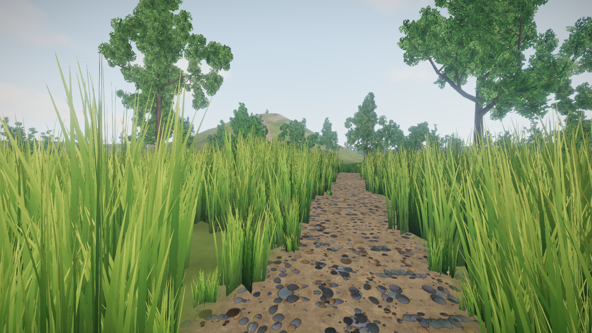
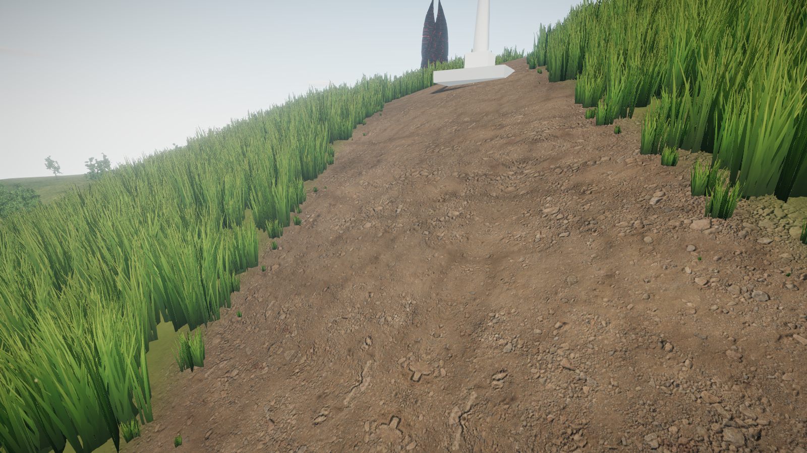
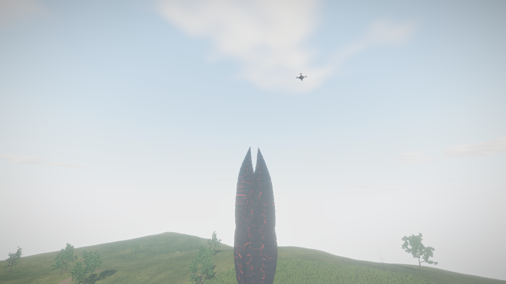
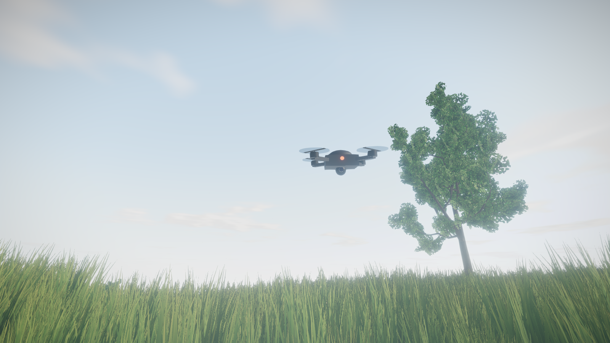

# 🌲 The Forest

**Un mundo abierto en primera persona, realista y explorable, corriendo íntegramente en el navegador.**

Construido desde cero con **WebGL 2 + Three.js + TypeScript**, sin motor de juegos: terreno, vegetación, cielo, clima, audio y entidades son sistemas propios. Casi todo el mundo es **generado proceduralmente por código** — las texturas se dibujan en canvas, los árboles crecen por algoritmo, el viento y las aves se sintetizan en tiempo real — complementado con un puñado de assets propios (la efigie, los cristales y el material fotogramétrico del sendero).

> Camina por una pradera de pasto alto mecido por el viento, sigue el sendero pedregoso que serpentea ladera arriba entre árboles, cruza el anillo de cristales de la cumbre y encara la efigie del Marcador, cuyos glifos laten en rojo… bajo la mirada de un dron que bajará a inspeccionarte.

---

## 📸 Capturas

| | |
|---|---|
|  |  |
| *La pradera y el sendero de entrada* | *La trocha erosionada subiendo el cerro* |
|  |  |
| *La efigie y su anillo de cristales* | *El dron durante una inspección* |

---

## ✨ Características

### Mundo
- **Terreno de 600×600 m** generado por heightfield analítico (fBm multicapa): pradera, loma del sendero, cerro coronable de ~74 m y cordón de colinas boscosas en el horizonte.
- **Sendero pedregoso** que serpentea desde la pradera hasta la cumbre, recubierto con **material fotogramétrico PBR** (albedo + normal map) alineado con un relieve macro horneado desde malla, que se ensancha y erosiona cuesta arriba.
- **Pasto instanciado** (45k–220k matas según preset) con *wrap toroidal* en GPU: el campo de pasto sigue al jugador hasta ~110 m sin costo de CPU, con viento de dos frecuencias, translucidez a contraluz y desvanecimiento por hundimiento.
- **Bosque procedural**: árboles generados por esqueleto recursivo (algoritmo estilo ez-tree) con 3 niveles de ramificación, hojas en las puntas y **LOD dinámico de 3 niveles** redistribuido por distancia.
- **Cielo vivo**: atmósfera física (shader Sky + IBL), **nubes procedurales ancladas al mundo** que derivan, mutan y **proyectan sombras móviles** sobre el terreno y el pasto — el mismo campo matemático define la nube y su sombra.
- **Rocas con musgo, troncos caídos, polen flotando** a contraluz.

### La cumbre
- **Efigie del Marcador** (Dead Space): modelo esculpido real de 1.4M de triángulos, decimado a 105k con herramienta propia, con **glifos emisivos proyectados por UVs cilíndricas que laten** cada ~6 segundos.
- **Anillo de cristales semimetálicos** semienterrados (solo asoman las puntas), con hueco donde llega el sendero.
- **Dron de vigilancia con IA**: patrulla en órbita elíptica sobre la efigie; si te acercas, **interrumpe la ronda, vuela hacia ti, te rodea inspeccionándote** con su cámara y LED de alerta, y regresa a su patrulla.

### Presentación
- **Iluminación**: sol direccional con sombras de 2048–4096 px que siguen al jugador con anclaje a texels (sin parpadeo), ambiente por IBL del propio cielo, niebla atmosférica.
- **Postproceso HDR**: bloom, tone mapping ACES, SMAA y viñeta.
- **Audio 100% sintetizado** con Web Audio API: viento con ráfagas sincronizadas al viento visual, trinos de aves con paneo y distancia, roce del pasto al caminar, pasos que cambian según la superficie (pasto/tierra) y aterrizajes con impacto.
- **Controlador de primera persona**: pointer lock, WASD, sprint, salto, head-bob, colisión con terreno, árboles, rocas y estructuras.

---

## 🚀 Instalación y ejecución

### Requisitos
- **Node.js 18+** (desarrollo y build)
- Navegador moderno con **WebGL 2** (Chrome, Edge, Firefox, Safari)
- Para publicar: cualquier servidor de archivos estáticos (Apache/XAMPP, nginx, Netlify, GitHub Pages…)

### Desarrollo

```bash
npm install
npm run dev        # → http://localhost:5173 con recarga instantánea
```

### Verificación de tipos y build de producción

```bash
npm run typecheck  # tsc --noEmit
npm run build      # genera dist/ (~6.4 MB, 100% estático)
npm run preview    # sirve dist/ localmente para probar
```

### Despliegue estático

La carpeta `dist/` es autocontenida y usa rutas relativas: funciona bajo cualquier subruta o dominio **solo con ser servida por HTTP**. Con XAMPP corriendo, el build queda accesible de inmediato en:

```
http://localhost/TheForest/dist/
```

> ⚠️ No funciona con doble clic sobre `index.html` (`file://`): los navegadores bloquean los módulos ES y el `fetch()` de los modelos. Siempre a través de un servidor.

### Presets de calidad

Ajustables por parámetro de URL — útil en equipos modestos o para exprimir GPUs potentes:

| URL | Pasto | Sombras | Pixel ratio |
|---|---|---|---|
| `?q=low` | 45 000 matas | 2048 px | ≤1.25 |
| `?q=med` *(defecto)* | 130 000 matas | 3072 px | ≤1.6 |
| `?q=high` | 220 000 matas | 4096 px | ≤2 |

---

## 🎮 Controles

| Tecla | Acción |
|---|---|
| **Clic** (en el menú) | Entrar al juego (captura el mouse y activa el audio) |
| **W A S D** / flechas | Moverse |
| **Mouse** | Mirar |
| **Shift** | Correr |
| **Espacio** | Saltar |
| **Esc** | Volver al menú |

---

## 📁 Estructura del proyecto

```
TheForest/
├── index.html                  # Página, menú y pantalla de carga
├── vite.config.ts              # base:'./' → build portable
├── public/                     # Assets servidos tal cual (copiados a dist/)
│   ├── models/                 #   Binarios decimados (.bin) y relieve
│   └── textures/               #   Material fotogramétrico optimizado
├── src/
│   ├── main.ts                 # Bootstrap, overlay, pointer lock
│   ├── core/
│   │   ├── Engine.ts           # Renderer, escena, bucle, presets, orquestación
│   │   ├── noise.ts            # PRNG determinista + value noise + fBm + ridged
│   │   ├── textures.ts         # Texturas procedurales dibujadas en canvas
│   │   ├── cloudGlsl.ts        # Campo de nubes GLSL compartido (cielo ↔ sombras)
│   │   └── uniforms.ts         # Uniforms compartidos (viento, jugador, sol)
│   ├── world/
│   │   ├── heightfield.ts      # Relieve analítico, máscara de pasto, sendero
│   │   ├── Terrain.ts          # Malla + shader de splatting con PBR del camino
│   │   ├── Grass.ts            # Pradera instanciada con wrap toroidal en GPU
│   │   ├── TreeGen.ts          # Generador de árboles por esqueleto recursivo
│   │   ├── Trees.ts            # Bosque instanciado con LOD dinámico
│   │   ├── SkyEnv.ts           # Cielo, sol, sombras, niebla, domo de nubes
│   │   ├── Landmarks.ts        # Efigie, cristales y obelisco
│   │   ├── Drone.ts            # Dron con máquina de estados de vuelo
│   │   └── Details.ts          # Rocas, troncos, polen
│   ├── player/
│   │   └── FirstPersonController.ts
│   ├── audio/
│   │   └── AudioSystem.ts      # Viento, aves, pasos — todo sintetizado
│   └── fx/
│       └── PostProcessing.ts   # Bloom + ACES + SMAA + viñeta
├── tools/
│   ├── decimate-stl.mjs        # STL → .bin indexado (clustering de vértices)
│   └── bake-relief.mjs         # Malla de relieve → textura de altura
├── ARCHITECTURE.md             # Documentación técnica profunda de cada sistema
└── PLAN.md                     # Plan original y bitácora de fases
```

---

## 🔬 Documentación técnica

La documentación extensa de cada sistema — algoritmos, formatos binarios, shaders, decisiones de diseño y los *gotchas* encontrados durante el desarrollo — está en **[ARCHITECTURE.md](ARCHITECTURE.md)**. Índice rápido:

1. Motor y bucle principal
2. Terreno: heightfield analítico y shader de splatting
3. Pradera: instancing con wrap toroidal en GPU
4. Bosque: esqueletos recursivos y LOD por redistribución de instancias
5. Cielo: atmósfera, nubes ancladas al mundo y sombras de nubes
6. La cumbre: pipeline de assets (decimación STL, UVs cilíndricas, horneado de relieve)
7. Dron: máquina de estados de vuelo
8. Audio procedural con Web Audio API
9. Postproceso y pipeline de color
10. Rendimiento y presets

---

## 🛠️ Pipeline de assets

Herramientas propias en `tools/`, pensadas para regenerar los binarios cuando cambien las fuentes:

```bash
# STL (cualquier tamaño) → binario indexado compacto para el juego
node tools/decimate-stl.mjs src/models/efigie.stl public/models/efigie.bin 0.4

# Malla de relieve (grid regular OBJ) → textura de altura binaria
node tools/bake-relief.mjs
```

El formato `.bin` es deliberadamente simple: `[u32 nVerts][u32 nTris][f32 posiciones][u32 índices]`, Y-up, base en y=0 — se carga con un `fetch` y dos `TypedArray`, sin loaders externos. La efigie pasó de **70 MB / 1.41M triángulos a 1.8 MB / 105k** conservando su silueta y bandas talladas.

---

## ⚡ Rendimiento

Diseñado para sostener **60 FPS en GPUs de gama media** a 1080p:

- Pasto: un solo `InstancedMesh`; el "seguimiento infinito" del jugador se resuelve con aritmética modular en el vertex shader (cero trabajo de CPU).
- Árboles: geometría compartida por variante; el LOD reasigna instancias entre 3 mallas por distancia solo cuando el jugador se desplaza >6 m.
- Sombras: un único mapa direccional que sigue al jugador anclado a la cuadrícula de texels.
- Nubes: un draw call; sus sombras son ~12 evaluaciones extra de ruido por píxel de suelo.
- Los presets `low/med/high` escalan densidad de pasto, resolución de sombras y pixel ratio.

---

## 🙏 Créditos e inspiraciones

- **[Three.js](https://threejs.org/)** — el motor de render que lo hace todo posible (MIT).
- **[postprocessing](https://github.com/pmndrs/postprocessing)** (pmndrs) — pipeline de efectos (Zlib).
- **[ez-tree](https://github.com/dgreenheck/ez-tree)** de Daniel Greenheck (MIT) — el algoritmo de esqueleto recursivo de los árboles es una reimplementación propia inspirada en su diseño.
- **Three.js Sky Pro** — el concepto de sombras de nubes proyectadas sobre la escena se asimiló de su arquitectura (reimplementado desde cero para WebGL 2).
- La efigie, los cristales y el material fotogramétrico del sendero son assets propios del autor.

---

## 🤝 Contribución

Este proyecto es **Open Source** y vive gracias a la comunidad. ¡Tus contribuciones son bienvenidas!

### Cómo Contribuir

1. **Fork** del repositorio
2. **Crea tu rama** de característica
   ```bash
   git checkout -b feature/nueva-funcionalidad
   ```
3. **Asegúrate de que compila y tipa correctamente**
   ```bash
   npm run typecheck && npm run build
   ```
4. **Haz commit de tus cambios**
   ```bash
   git commit -m 'Add: Nueva funcionalidad increíble'
   ```
5. **Push a tu rama**
   ```bash
   git push origin feature/nueva-funcionalidad
   ```
6. **Abre un Pull Request**

### Directrices de Contribución

- ✅ Mantén el tipado estricto de TypeScript (`"strict": true`)
- ✅ Prefiere lo procedural: texturas en canvas, geometría por código, audio sintetizado
- ✅ Documenta los shaders y algoritmos no triviales
- ✅ Verifica visualmente los cambios en los tres presets de calidad
- ✅ Actualiza la documentación relevante ([ARCHITECTURE.md](ARCHITECTURE.md))

### Áreas que Necesitan Ayuda

- 📝 Mejoras en documentación
- 🧪 Pruebas automatizadas (unitarias y de humo con navegador headless)
- 🌅 Ciclo día/noche con estrellas y luna
- 🔊 Audio posicional (zumbido de la efigie y del dron)
- 🌍 Traducciones de documentación
- 🐛 Reportes de bugs

---

## 🤝 Soporte y Comunidad

### ¿Necesitas Ayuda?

- 📖 **Documentación**: Lee el [README completo](README.md) y [ARCHITECTURE.md](ARCHITECTURE.md)
- 🐛 **Reportar bugs**: Abre un [issue en GitHub](https://github.com/jalexiscv/TheForest/issues)
- 💡 **Solicitar funcionalidades**: Usa las [GitHub Discussions](https://github.com/jalexiscv/TheForest/discussions)
- 📧 **Contacto directo**: jalexiscv@gmail.com

### Comunidad

- **Discusiones**: Únete a las conversaciones en GitHub Discussions
- **Contribuciones**: Revisa los [issues etiquetados como "good first issue"](https://github.com/jalexiscv/TheForest/labels/good%20first%20issue)

---

## 📜 Licencia

Distribuido bajo la Licencia **MIT**. Ver [LICENSE](LICENSE) para más información.

> La licencia MIT te permite usar, copiar, modificar, fusionar, publicar, distribuir, sublicenciar y/o vender copias del software sin restricciones, siempre que se incluya el aviso de copyright.

---

## 👨‍💻 Autor

**Jose Alexis Correa Valencia**  
*Full Stack Developer & Software Architect*

Con más de 25 años de experiencia en desarrollo de software empresarial, especializado en arquitecturas escalables y soluciones modernas.

- **GitHub**: [@jalexiscv](https://github.com/jalexiscv)
- **LinkedIn**: [Jose Alexis Correa Valencia](https://www.linkedin.com/in/jalexiscv/)
- **Email**: jalexiscv@gmail.com
- **Ubicación**: Colombia 🇨🇴

---

## ❤️ Donaciones

Si The Forest te ha ayudado a ti o a tu negocio, considera apoyar su desarrollo y mantenimiento continuo.

| Método | Detalles |
|--------|----------|
| **PayPal** | [jalexiscv@gmail.com](https://www.paypal.com/paypalme/anssible) |
| **Nequi (Colombia)** | `3117977281` |

### Beneficios de tu Soporte

Tu donación ayuda a:
- ⚡ Acelerar el desarrollo de nuevas funcionalidades
- 📚 Crear más documentación y ejemplos
- 🧪 Mejorar la cobertura de tests
- 🎨 Implementar más sistemas visuales (día/noche, clima, estaciones)
- 🌍 Mantener el proyecto activo y actualizado

*¡Gracias por tu apoyo!* 🙏

---

<div align="center">

**Desarrollado con ❤️ para la comunidad WebGL / Three.js**

[⬆ Volver arriba](#-the-forest)

</div>
